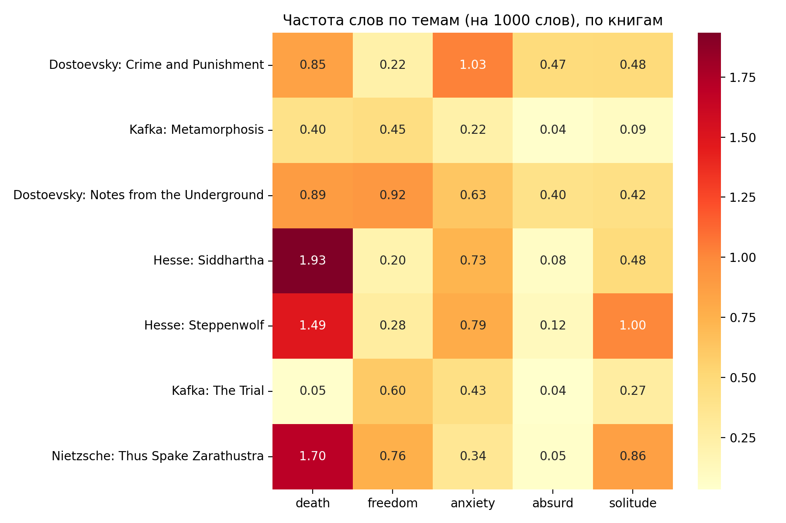

# existential-literature-nlp

# Existential Themes in Literature: A Word-Frequency Analysis

## Research question

How are words related to **death, freedom, anxiety, the absurd and solitude**
distributed across seven works by four authors often associated with
existentialist themes, and do the differences follow authors or individual books?

## Corpus

Texts are English translations from [Project Gutenberg](https://www.gutenberg.org).

| Author | Book | Gutenberg ID | Words |
|---|---|---|---|
| Fyodor Dostoevsky | Notes from the Underground | 600 | 44,733 |
| Fyodor Dostoevsky | Crime and Punishment | 2554 | 209,022 |
| Franz Kafka | Metamorphosis | 5200 | 22,377 |
| Franz Kafka | The Trial | 7849 | 84,327 |
| Friedrich Nietzsche | Thus Spake Zarathustra | 1998 | 113,582 |
| Hermann Hesse | Steppenwolf | 75756 | 75,864 |
| Hermann Hesse | Siddhartha | 2500 | 39,799 |

## Method

1. Downloaded each text and removed the Project Gutenberg headers and footers.
2. Split the text into lowercase words.
3. Defined a keyword list for each theme (`THEMES` in the notebook).
4. Counted keyword occurrences and normalised them to **occurrences per 1,000 words**,
   so long and short books can be compared.
5. Checked examples and kept the list unchanged.

## Results

## Findings

**1. Explicit talk about death is concentrated in Hesse and Nietzsche.**
*Siddhartha* (1.93), *Thus Spake Zarathustra* (1.70) and *Steppenwolf* (1.49)
have the highest death-word frequency. In *Zarathustra* much of this comes from
a few repeated passages (e.g. the chapter on voluntary death), so it reflects
concentrated passages rather than the whole book.

**2. Different books emphasise different themes.**
*Steppenwolf* leads on solitude (1.00), *Crime and Punishment* on anxiety (1.03),
and *Notes from the Underground* on freedom (0.92).

**3. Kafka barely uses these words, even where the theme is present.**
*The Trial* has almost no death vocabulary (0.05 per 1,000 words), although the
novel ends with the protagonist's execution. Kafka seems to express anxiety and
death through situation and atmosphere rather than through the words themselves,
which a keyword count cannot capture.

**4. Differences between books can be as large as differences between authors.**
The two Dostoevsky novels differ strongly: freedom 0.92 vs 0.22, anxiety 0.63 vs 1.03.
A single book should not be treated as representative of an author.

**5. The "absurd" vocabulary is nearly empty.**
No book goes above 0.5 per 1,000 words. My word list mostly does not match how
these authors write about meaninglessness, so this theme is not measured well.

## Limitations

- **Translations.** Word choice partly reflects the translator, not only the author.
- **Small corpus.** Seven books, one or two per author. No statistical testing was done.
- **Small counts.** For rare themes the numbers rest on very few words: e.g. 0.04 per
  1,000 words in *Metamorphosis* is about one occurrence in the whole book.
- **Keyword choice.** Results depend on which words I put into each theme.
  Words are matched by exact form, without lemmatisation.
- **Counting is not understanding.** A word appearing does not mean the theme is
  discussed philosophically, and themes expressed without these words are missed.

## Next steps

- Compute sentence embeddings for text chunks and map them with UMAP to see
  whether authors cluster by content and not only by vocabulary.
- Add more books, ideally multiple translations of the same work.

## How to run

Open `analysis.ipynb` in Google Colab and run the cells from top to bottom.
Requires: `requests`, `pandas`, `matplotlib`, `seaborn`.
