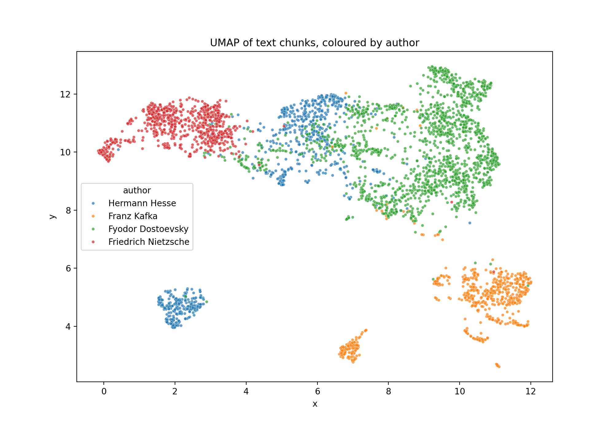
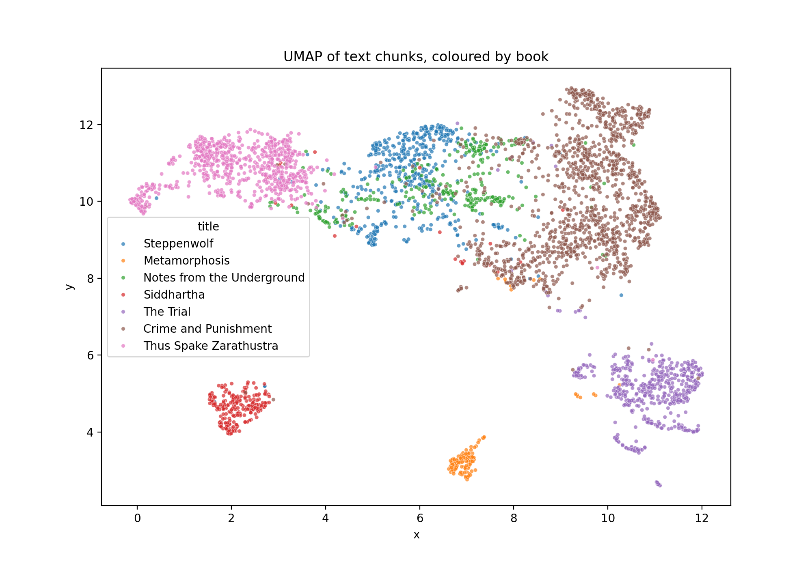

# Existential Themes in Literature: Word Frequencies and Embeddings

A small digital-humanities project that asks whether words and text embeddings
distinguish authors associated with existentialist themes, or whether differences
between individual books are larger.

## Research question

How are words related to **death, freedom, anxiety, the absurd and solitude**
distributed across seven works by four authors often associated with
existentialist themes, and do the differences follow authors or individual books?

## Corpus

Texts are English translations from [Project Gutenberg](https://www.gutenberg.org).

| Author | Book | Gutenberg ID | Words |
|---|---|---|---|
| Fyodor Dostoevsky | Notes from the Underground | 600 | 44,733 |
| Fyodor Dostoevsky | Crime and Punishment | 2554 | 209,022 |
| Franz Kafka | Metamorphosis | 5200 | 22,377 |
| Franz Kafka | The Trial | 7849 | 84,327 |
| Friedrich Nietzsche | Thus Spake Zarathustra | 1998 | 113,582 |
| Hermann Hesse | Steppenwolf | 75756 | 75,864 |
| Hermann Hesse | Siddhartha | 2500 | 39,799 |

## Method

### 1. Word frequencies

1. Downloaded each text and removed the Project Gutenberg header and footer.
2. Split the text into lowercase words.
3. Defined a keyword list for each theme (below).
4. Counted keyword occurrences and normalised them to **occurrences per 1,000 words**,
   so long and short books can be compared.
5. Read random keyword-in-context examples for some keywords to check how the words
   are used (the keyword lists were not changed afterwards).

**Keyword lists**

| Theme | Words |
|---|---|
| death | death, die, died, dying, dead, grave, corpse |
| freedom | free, freedom, liberty, choice, choose |
| anxiety | anxiety, dread, fear, terror, afraid, anguish |
| absurd | absurd, meaningless, senseless, nonsense, futile |
| solitude | alone, lonely, solitude, isolation, loneliness |

### 2. Embeddings

1. Split each book into chunks of 150 words (the model reads about 256 tokens).
2. Converted each chunk to a vector with the `all-MiniLM-L6-v2` sentence-transformer.
3. Projected the vectors to 2D with UMAP and coloured the points by author and by book.
4. Tested author prediction on unseen books: a logistic regression was trained on one
   book per author and tested on a different book by the same authors. Nietzsche was
   excluded because only one of his books is in the corpus. Balanced accuracy was used
   because the books differ a lot in length.

## Results

### Word frequencies

### Embedding map (UMAP)

### Author prediction on unseen books

| Split | Balanced accuracy |
|---|---|
| Train on Steppenwolf, Metamorphosis, Notes from the Underground; test on Siddhartha, The Trial, Crime and Punishment | 0.59 |
| Train on Siddhartha, The Trial, Crime and Punishment; test on Steppenwolf, Metamorphosis, Notes from the Underground | 0.40 |
| Chance level (three authors) | 0.33 |

## Findings

**1. Explicit talk about death is concentrated in Hesse and Nietzsche.**
*Siddhartha* (1.93), *Thus Spake Zarathustra* (1.70) and *Steppenwolf* (1.49)
have the highest death-word frequency per 1,000 words. In *Zarathustra* much of this
comes from a few repeated passages (e.g. the chapter on voluntary death), so it reflects
concentrated passages rather than the whole book.

**2. Different books emphasise different themes.**
*Steppenwolf* leads on solitude (1.00), *Crime and Punishment* on anxiety (1.03),
and *Notes from the Underground* on freedom (0.92).

**3. Kafka barely uses these words, even where the theme is present.**
*The Trial* has almost no death vocabulary (0.05 per 1,000 words), although the
novel ends with the protagonist's execution. Kafka seems to express anxiety and
death through situation and atmosphere rather than through the words themselves,
which a keyword count cannot capture.

**4. Differences between books can be as large as differences between authors.**
The two Dostoevsky novels differ strongly: freedom 0.92 vs 0.22, anxiety 0.63 vs 1.03.

**5. The "absurd" vocabulary is nearly empty.**
No book goes above 0.5 per 1,000 words. My word list mostly does not match how
these authors write about meaninglessness, so this theme is not measured well.

**6. In the embedding map, chunks group mainly by book, not by author.**
The two Hesse books lie far apart: *Siddhartha* forms an isolated cluster, while
*Steppenwolf* sits in the centre. Kafka's two books both lie in the lower part of
the map, but as separate clusters, so any author signal there is weak.

**7. Narrative form may matter.**
*Notes from the Underground* lies close to *Steppenwolf* (both first-person and
introspective), while *Crime and Punishment* (third-person, dialogue-heavy) is
elsewhere. This is a hypothesis and was not tested.

**8. Nietzsche forms one compact cluster.**
The archaic English of the translation (e.g. "-eth" verbs) may contribute to this
separation.

**9. Author identity transfers to unseen books only weakly.**
Balanced accuracy of 0.59 and 0.40 is only somewhat above the chance level of 0.33,
and the result depends strongly on which books are used for training.

## Conclusion

Both methods point in the same direction: **differences between individual books
are at least as large as differences between authors.** Word frequencies vary as much
between the two Dostoevsky novels as between different authors; in the embedding map,
the two Hesse books lie far apart; and an author classifier trained on one book
per author only weakly beats chance on unseen books. Conclusions about authors as a
whole would therefore be premature with this corpus.

Two observations may deserve follow-up: Kafka expresses death and anxiety
with almost no explicit vocabulary, so keyword counts miss it; and first-person
introspective books appear close together on the map, which suggests narrative
form may matter as much as theme.

## Limitations

- **Translations.** Word choice partly reflects the translator, not only the author.
  The archaic English in *Zarathustra* is one example.
- **Small corpus.** Seven books, one or two per author. No statistical testing was done.
- **Small counts.** For rare themes the numbers rest on very few words: e.g. 0.04 per
  1,000 words in *Metamorphosis* is about one occurrence in the whole book.
- **Keyword choice.** Results depend on which words I put into each theme.
  Words are matched by exact form, without lemmatisation.
- **Counting is not understanding.** A word appearing does not mean the theme is
  discussed philosophically, and themes expressed without these words are missed.
- **Embedding input.** Chunks were embedded as lowercase text without punctuation, and
  character names were not removed, so names may drive some clusters.
- **Classifier.** Each number comes from a single train/test split with three authors
  and no confidence intervals.
- **UMAP.** The map is good for seeing which chunks are close to each other, but
  distances between far-apart clusters should not be over-interpreted.

## Next steps

- Mask character names and re-check the map and the classifier.
- Add more books, ideally several translations of the same work.
- Extend the "absurd" word list and add lemmatisation.
- Split books into chunks and show variation of keyword frequencies between chunks
  (for example with boxplots) instead of a single number per book.

## Repository contents

- `analysis.ipynb`: full analysis (run in Google Colab)
- `heatmap_books.png`, `umap_authors.png`, `umap_books.png`: figures
- `README.md`: this file

## How to run

Open `analysis.ipynb` in Google Colab and choose **Runtime → Run all**.
The notebook downloads the books from Project Gutenberg, so it needs an internet connection.
Requires: `requests`, `pandas`, `matplotlib`, `seaborn`, `scikit-learn`,
`sentence-transformers`, `umap-learn` (the notebook installs the last two).
